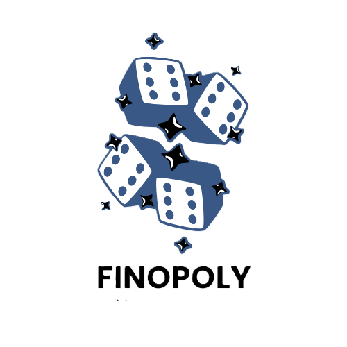
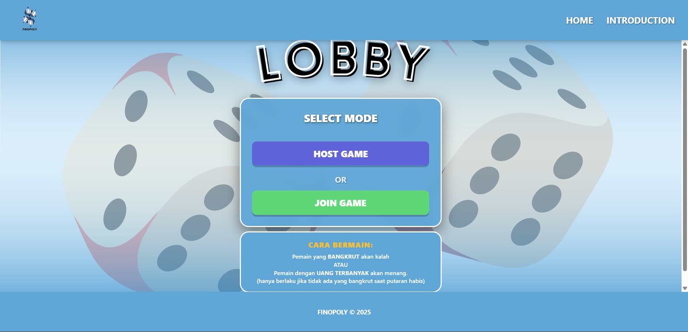
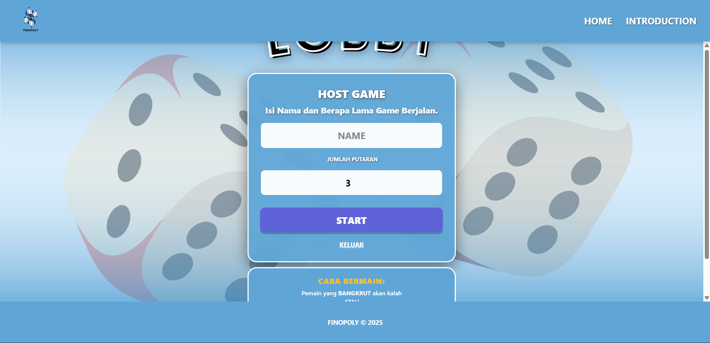
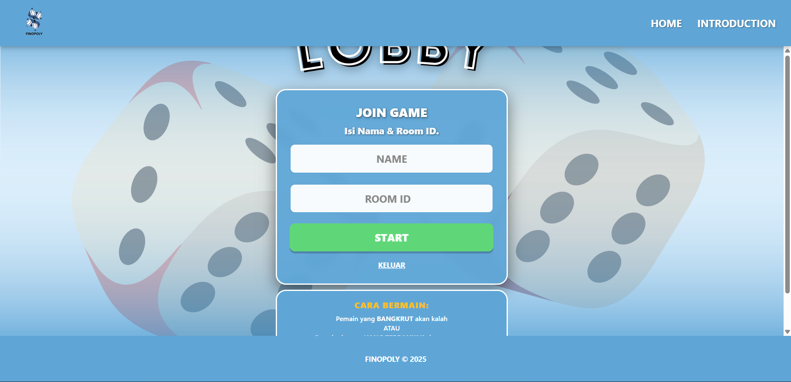

# Finopoly: Platform Gamifikasi Edukasi Literasi Keuangan



## Deskripsi Proyek

Finopoly adalah aplikasi permainan strategi multiplayer berbasis web yang dirancang untuk meningkatkan literasi keuangan melalui pendekatan gamifikasi. Mengadopsi mekanika permainan papan klasik, aplikasi ini mensimulasikan skenario ekonomi dunia nyata seperti akuisisi aset, pengelolaan arus kas, pembayaran pajak, dan investasi.

Tujuan utama dari platform ini adalah memberikan pemahaman praktis mengenai konsep finansial kepada pengguna dengan cara yang interaktif, kompetitif, dan mudah dipahami, menjembatani kesenjangan antara teori keuangan dan praktik simulasi.

## Pratinjau Aplikasi

**Tautan Demo:** [finopoly-game.vercel.app](https://finopoly-game.vercel.app)

**Tampilan Antarmuka:**

1.  **Lobby & Waiting Room**
    
    
    
    *Antarmuka pembuatan ruang permainan dan sinkronisasi pemain.*

2.  **Gameplay & Board**
    
    *Papan permainan interaktif dengan fitur dadu, kartu aset, dan kuis.*

## Fitur Utama

* **Real-time Multiplayer:** Sinkronisasi status permainan antar pemain secara instan menggunakan Firebase Realtime Database.
* **Manajemen Aset & Ekonomi:** Simulasi pembelian sektor aset, pembayaran sewa, dividen, dan dampak pajak.
* **Mekanisme Turn-Based:** Sistem giliran otomatis dengan validasi logika server untuk mencegah kecurangan.
* **Edukasi Interaktif:** Integrasi kuis finansial dan infografis edukatif yang muncul pada petak-petak tertentu untuk memberikan wawasan keuangan.
* **Sistem Lobby:** Fitur pembuatan ruang (Host) dengan pengaturan jumlah putaran kustom dan sistem Join Room menggunakan ID unik.
* **Desain Responsif:** Tampilan antarmuka yang adaptif untuk perangkat Desktop dan Mobile.
* **Penanganan Koneksi:** Sistem auto-forfeit (menyerah otomatis) untuk menjaga integritas permainan jika lawan terputus dari jaringan.

## Tech Stack

Proyek ini dibangun menggunakan teknologi modern untuk memastikan performa, skalabilitas, dan kemudahan pemeliharaan:

* **Bahasa Pemrograman:** TypeScript
* **Frontend Framework:** React.js (Vite)
* **Styling:** CSS3, Tailwind CSS
* **Backend as a Service (BaaS):** Firebase Realtime Database
* **Aset & Media:** Integrasi audio HTML5 dan manajemen aset gambar statis
* **Routing:** React Router DOM
* **Deployment:** Vercel

## Struktur Direktori

Arsitektur proyek disusun secara modular untuk memisahkan logika bisnis, komponen UI, dan aset data.
finopoly/
├── public/
│   ├── img/
│   │   ├── asset/         # Gambar aset properti
│   │   ├── board/         # Gambar papan permainan
│   │   ├── infografis/    # Materi edukasi finansial
│   │   ├── jail/          # Aset visual penjara
│   │   ├── quiz/          # Aset visual kuis
│   │   ├── tiles/         # Ikon setiap petak papan
│   │   └── ...
│   └── vite.svg
│
├── src/
│   ├── Audio/
│   │   └── game_music.mp3 # Audio latar permainan
│   │
│   ├── components/
│   │   ├── GamePage.tsx        # Logika inti permainan dan rendering papan
│   │   ├── GameRoom.tsx        # Orkestrator state global (Lobby <-> Game)
│   │   ├── HomePage.tsx        # Halaman pendaratan
│   │   ├── IntroductionPage.tsx# Halaman panduan / intro permainan
│   │   ├── LobbyPage.tsx       # Halaman pembuatan dan join room
│   │   ├── WaitingRoomPage.tsx # Ruang tunggu sebelum game dimulai
│   │   └── ...                 # File CSS dan komponen pendukung
│   │
│   ├── data/
│   │   └── boardData.js    # Konfigurasi data statis petak papan
│   │
│   ├── img/                # Aset grafis UI (logo, dadu, background)
│   ├── App.tsx             # Konfigurasi routing utama
│   ├── firebase.js         # Inisialisasi dan konfigurasi Firebase
│   └── main.tsx            # Entry point aplikasi React
│
├── index.html
├── package.json
└── ...

## Penjelasan Kode

## Penjelasan Kode

Berikut adalah rincian peran dari setiap file utama dalam struktur proyek ini:

### 1. Core Logic & State Management
* **`src/components/GameRoom.tsx` (State Orchestrator)**
    Bertindak sebagai komponen pengendali utama ("High-Order Component") yang mengatur alur *stage* aplikasi (`LOBBY` → `WAITING` → `PLAYING`). Komponen ini menyimpan *global state* sementara seperti `roomId`, `playerRole`, dan `playerName` untuk memastikan data sesi tetap terjaga saat terjadi transisi antar halaman.

* **`src/components/GamePage.tsx` (Gameplay Engine)**
    Komponen terbesar yang menangani seluruh logika inti permainan saat game berjalan, meliputi:
    * **Mekanika Dadu:** Mengelola pengacakan angka dadu dan animasi pergerakan pion pemain.
    * **Sistem Ekonomi:** Mengkalkulasi saldo pemain secara real-time (transaksi pembelian aset, pembayaran sewa, denda pajak, dan penerimaan dividen).
    * **Validasi Aturan:** Mengecek kondisi kemenangan (apakah putaran habis atau lawan bangkrut) dan memicu status *Game Over*.
    * **Sinkronisasi Real-time:** Mendengarkan perubahan data dari Firebase untuk memperbarui posisi dan status lawan di papan.

### 2. Lobby & Matchmaking System
* **`src/components/LobbyPage.tsx`**
    Antarmuka gerbang masuk permainan. Menyediakan dua mode utama:
    * **Host Game:** Membuat *room* baru, men-generate Room ID unik, dan mengatur konfigurasi awal (seperti jumlah putaran).
    * **Join Game:** Formulir untuk pemain kedua memasukkan Room ID agar bisa terhubung ke sesi permainan yang sudah dibuat.

* **`src/components/WaitingRoomPage.tsx`**
    Ruang tunggu (staging area) sebelum permainan dimulai. Berfungsi untuk:
    * Menampilkan kode Room ID agar mudah dibagikan.
    * Memantau status koneksi lawan secara *real-time*.
    * Memberikan tombol "Mulai" bagi Host setelah semua pemain siap.

* **`src/components/Lobby.css`**
    Berisi *styling* khusus yang digunakan bersama oleh `LobbyPage` dan `WaitingRoomPage`. Mengatur desain kartu panel (Glassmorphism), tipografi judul, dan animasi transisi elemen UI.

### 3. Static Pages & Styling
* **`src/components/HomePage.tsx`**
    Halaman pendaratan (*landing page*) aplikasi. Berisi navigasi utama menuju permainan atau halaman edukasi, serta menampilkan *branding* visual Finopoly.

* **`src/components/HomePage.css`**
    Mengatur tata letak visual halaman utama, termasuk *background* responsif dan animasi logo.

* **`src/components/IntroductionPage.tsx`**
    Halaman edukasi yang menyajikan materi literasi keuangan, panduan cara bermain, dan informasi tentang pengembang. Halaman ini statis dan fokus pada penyampaian informasi.

* **`src/components/IntroductionPage.css`**
    *Style sheet* untuk halaman edukasi, memastikan teks artikel dan infografis mudah dibaca (*readability*) pada berbagai ukuran layar.

### 4. Data & Configuration
* **`src/data/boardData.js`**
    Database lokal berbentuk array objek yang mendefinisikan struktur papan permainan. Setiap objek merepresentasikan satu petak (*tile*) dengan properti seperti:
    * `id`: Indeks petak (0-31).
    * `type`: Jenis petak (ASSET, TAX, CHANCE, JAIL, START, dll).
    * `price`, `rent`: Nilai ekonomi untuk petak properti.
    * `image`: Referensi ke aset gambar visual petak tersebut.

* **`src/firebase.js`**
    Konfigurasi inisialisasi koneksi ke Firebase Realtime Database. Menggunakan *environment variables* untuk mengamankan kredensial API key.

## Cara Menjalankan Secara Lokal

Ikuti langkah-langkah berikut untuk menjalankan proyek di lingkungan pengembangan lokal:

1.  **Clone Repositori**
    ```bash
    git clone [https://github.com/username/finopoly.git](https://github.com/username/finopoly.git)
    cd finopoly
    ```

2.  **Instalasi Dependensi**
    Pastikan Node.js telah terinstal pada mesin Anda.
    ```bash
    npm install
    ```

3.  **Konfigurasi Environment**
    Buat file `.env` di direktori root dan tambahkan kredensial Firebase Anda:
    ```env
    VITE_FIREBASE_API_KEY=your_api_key
    VITE_FIREBASE_AUTH_DOMAIN=your_project.firebaseapp.com
    VITE_FIREBASE_DATABASE_URL=your_database_url
    VITE_FIREBASE_PROJECT_ID=your_project_id
    VITE_FIREBASE_STORAGE_BUCKET=your_storage_bucket
    VITE_FIREBASE_MESSAGING_SENDER_ID=your_sender_id
    VITE_FIREBASE_APP_ID=your_app_id
    ```

4.  **Jalankan Server Development**
    ```bash
    npm run dev
    ```
    Akses aplikasi melalui `http://localhost:5173`.

## Latar Belakang Pembuatan

Literasi keuangan merupakan keterampilan hidup yang esensial, namun metode pembelajaran konvensional seringkali dianggap membosankan dan teoritis. Finopoly dikembangkan sebagai solusi untuk membuat pembelajaran ini menjadi pengalaman yang menarik. Dengan mensimulasikan konsekuensi finansial dalam lingkungan permainan yang aman, pengguna dapat belajar mengambil keputusan keuangan strategis tanpa risiko nyata.

## Batasan Proyek

* **Kapasitas Pemain:** Saat ini dioptimalkan untuk mode 1 lawan 1 (2 pemain).
* **Konektivitas:** Membutuhkan koneksi internet yang stabil karena ketergantungan penuh pada database online.
* **Persistensi Data:** Data ruangan (Room Data) bersifat sementara dan dirancang untuk dihapus setelah sesi permainan selesai.

## Rencana Pengembangan

* Dukungan untuk multiplayer hingga 4 pemain dalam satu ruangan.
* Implementasi sistem autentikasi pengguna untuk menyimpan riwayat kemenangan dan papan peringkat (Leaderboard).
* Penambahan mekanisme pasar saham dinamis untuk simulasi investasi yang lebih kompleks.
* Pengembangan mode Single Player melawan AI.

## Penulis

Dikembangkan oleh **M. Rifqy Febryantoni**.

## Lisensi

Proyek ini didistribusikan di bawah Lisensi MIT. Silakan lihat file `LICENSE` untuk informasi lebih lanjut.